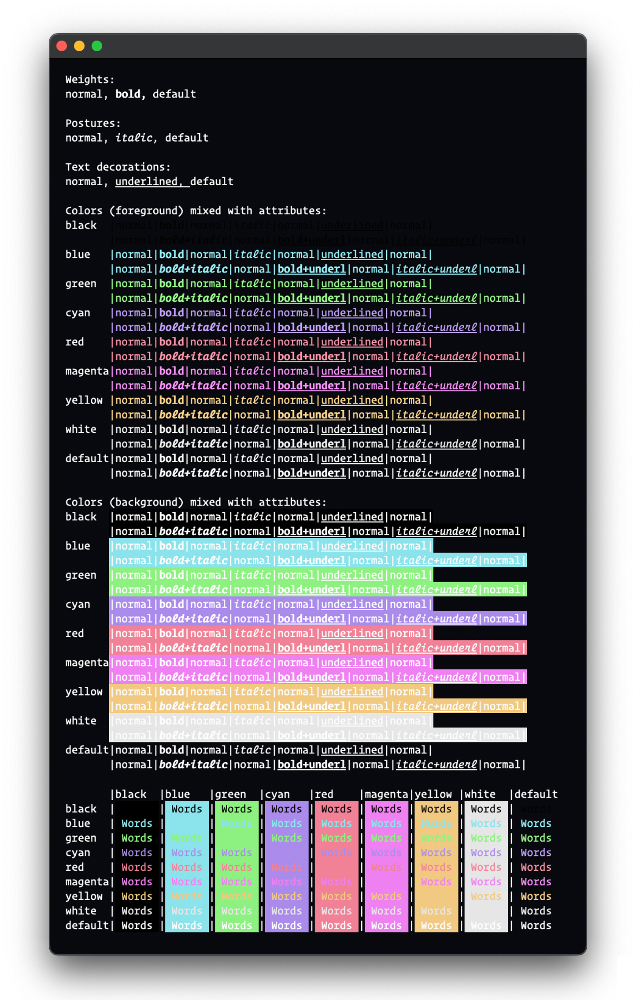

 

<h1 align="center">
Vicious Theme for <a href="https://en.wikipedia.org/wiki/Terminal_(macOS)">Terminal (macOS)</a>
</h1>

<h2 align="center">
 A Sleek & Immersive Dark Theme
</h2>
Elevate your coding experience with Vicious, a sleek and immersive dark theme for <a href="https://en.wikipedia.org/wiki/Terminal_(macOS)">Terminal (macOS)</a>. Designed for minimalism, readability, and aesthetics, Vicious enhances your focus and reduces eye strain. Customize it to match your style and enjoy an elegant and efficient coding environment.
   

[![Stars](https://img.shields.io/github/stars/zaheralmajed/vicious-theme-terminal?logo=data:image/svg%2bxml;base64,PHN2ZyB3aWR0aD0iNjQiIGhlaWdodD0iNjQiIHZpZXdCb3g9IjAgMCA2NCA2NCIgZmlsbD0ibm9uZSIgeG1sbnM9Imh0dHA6Ly93d3cudzMub3JnLzIwMDAvc3ZnIj4KPGcgaWQ9IlByb3BlcnR5IDE9ZmktcnItc3RhciIgY2xpcC1wYXRoPSJ1cmwoI2NsaXAwXzdfNDc2MCkiPgo8cGF0aCBpZD0iVmVjdG9yIiBkPSJNNjMuNTYyMiAyMy40NTE1QzYzLjAxNjcgMjEuNzE1MiA2MS45MjcgMjAuMjAwNiA2MC40NTQxIDE5LjEzMTZDNTguOTgxMiAxOC4wNjI2IDU3LjIwMzQgMTcuNDk1OSA1NS4zODM1IDE3LjUxNTVINDMuNzMyOUw0MC4xOTQyIDYuNDg2MTVDMzkuNjM3NyA0Ljc1MDA0IDM4LjU0NDMgMy4yMzU1MiAzNy4wNzE1IDIuMTYwOTlDMzUuNTk4NyAxLjA4NjQ2IDMzLjgyMjcgMC41MDc0NDYgMzEuOTk5NSAwLjUwNzQ0NkMzMC4xNzY0IDAuNTA3NDQ2IDI4LjQwMDQgMS4wODY0NiAyNi45Mjc2IDIuMTYwOTlDMjUuNDU0OCAzLjIzNTUyIDI0LjM2MTMgNC43NTAwNCAyMy44MDQ5IDYuNDg2MTVMMjAuMjY2MiAxNy41MTU1SDguNjE1NTRDNi44MDE1MiAxNy41MTgxIDUuMDM0NzIgMTguMDkzOCAzLjU2NzQ4IDE5LjE2MDZDMi4xMDAyNSAyMC4yMjczIDEuMDA3NjUgMjEuNzMwNCAwLjQ0NTcyOCAyMy40NTUyQy0wLjExNjE5IDI1LjE4IC0wLjExODY3NyAyNy4wMzgyIDAuNDM4NjIyIDI4Ljc2NDVDMC45OTU5MjEgMzAuNDkwOCAyLjA4NDUgMzEuOTk2OCAzLjU0ODg3IDMzLjA2NzVMMTMuMDMxNSA0MC4wMDA4TDkuNDI2MiA1MS4xNjYyQzguODQzNTcgNTIuODk3OSA4LjgzNjE5IDU0Ljc3MTUgOS40MDUxNiA1Ni41MDc3QzkuOTc0MTQgNTguMjQ0IDExLjA4OSA1OS43NDk4IDEyLjU4MzUgNjAuODAwOEMxNC4wNTI1IDYxLjg4NTYgMTUuODMyNiA2Mi40NjY3IDE3LjY1ODYgNjIuNDU3NUMxOS40ODQ2IDYyLjQ0ODQgMjEuMjU4OSA2MS44NDk1IDIyLjcxNjkgNjAuNzUwMkwzMS45OTk1IDUzLjkxODJMNDEuMjg0OSA2MC43NDIyQzQyLjc1MTIgNjEuODIwNyA0NC41MjE3IDYyLjQwNjUgNDYuMzQxOSA2Mi40MTU0QzQ4LjE2MjEgNjIuNDI0MiA0OS45MzgyIDYxLjg1NTcgNTEuNDE0OSA2MC43OTE1QzUyLjg5MTYgNTkuNzI3MyA1My45OTI5IDU4LjIyMjMgNTQuNTYwMyA1Ni40OTI3QzU1LjEyNzcgNTQuNzYzMiA1NS4xMzIxIDUyLjg5ODMgNTQuNTcyOSA1MS4xNjYyTDUwLjk2NzUgNDAuMDAwOEw2MC40NjA5IDMzLjA2NzVDNjEuOTQyIDMyLjAxMDMgNjMuMDQzMyAzMC41MDQzIDYzLjYwMTkgMjguNzcyNEM2NC4xNjA1IDI3LjA0MDUgNjQuMTQ2NSAyNS4xNzQ4IDYzLjU2MjIgMjMuNDUxNVpNNTcuMzE0MiAyOC43NjA4TDQ2LjI2MzUgMzYuODM4MkM0NS44MDk2IDM3LjE2OTMgNDUuNDcxOSAzNy42MzUzIDQ1LjI5ODYgMzguMTY5N0M0NS4xMjUyIDM4LjcwNDEgNDUuMTI1MSAzOS4yNzk3IDQ1LjI5ODIgMzkuODE0Mkw0OS40OTgyIDUyLjgwMDhDNDkuNzEwNyA1My40NTk1IDQ5LjcwODkgNTQuMTY4NiA0OS40OTMgNTQuODI2MkM0OS4yNzcxIDU1LjQ4MzggNDguODU4MyA1Ni4wNTYgNDguMjk2NyA1Ni40NjA1QzQ3LjczNTEgNTYuODY1IDQ3LjA1OTcgNTcuMDgxIDQ2LjM2NzYgNTcuMDc3NUM0NS42NzU1IDU3LjA3NCA0NS4wMDIzIDU2Ljg1MTEgNDQuNDQ0OSA1Ni40NDA4TDMzLjU3ODIgNDguNDQwOEMzMy4xMjA1IDQ4LjEwNDYgMzIuNTY3NCA0Ny45MjMzIDMxLjk5OTUgNDcuOTIzM0MzMS40MzE2IDQ3LjkyMzMgMzAuODc4NiA0OC4xMDQ2IDMwLjQyMDkgNDguNDQwOEwxOS41NTQyIDU2LjQ0MDhDMTguOTk3MSA1Ni44NTY2IDE4LjMyMiA1Ny4wODQxIDE3LjYyNjkgNTcuMDkwNEMxNi45MzE4IDU3LjA5NjcgMTYuMjUyNyA1Ni44ODE1IDE1LjY4ODEgNTYuNDc1OUMxNS4xMjM2IDU2LjA3MDMgMTQuNzAyOSA1NS40OTU0IDE0LjQ4NyA1NC44MzQ2QzE0LjI3MTEgNTQuMTczOSAxNC4yNzEzIDUzLjQ2MTUgMTQuNDg3NSA1Mi44MDA4TDE4LjcwMDkgMzkuODE0MkMxOC44NzQgMzkuMjc5NyAxOC44NzM5IDM4LjcwNDEgMTguNzAwNSAzOC4xNjk3QzE4LjUyNzIgMzcuNjM1MyAxOC4xODk0IDM3LjE2OTMgMTcuNzM1NSAzNi44MzgyTDYuNjg0ODcgMjguNzYwOEM2LjEyODM1IDI4LjM1MzMgNS43MTQ4MyAyNy43ODA0IDUuNTAzMzggMjcuMTIzOUM1LjI5MTkzIDI2LjQ2NzMgNS4yOTMzNyAyNS43NjA4IDUuNTA3NSAyNS4xMDUxQzUuNzIxNjIgMjQuNDQ5NCA2LjEzNzQ3IDIzLjg3ODIgNi42OTU2NSAyMy40NzNDNy4yNTM4MyAyMy4wNjc3IDcuOTI1NzkgMjIuODQ5MyA4LjYxNTU0IDIyLjg0ODhIMjIuMjE1NUMyMi43ODAxIDIyLjg0ODggMjMuMzMwMSAyMi42Njk2IDIzLjc4NjMgMjIuMzM3QzI0LjI0MjYgMjIuMDA0NCAyNC41ODE0IDIxLjUzNTYgMjQuNzU0MiAyMC45OTgxTDI4Ljg4NzUgOC4xMTU0OEMyOS4wOTk3IDcuNDU2MjQgMjkuNTE1NiA2Ljg4MTMyIDMwLjA3NTMgNi40NzM0OEMzMC42MzUgNi4wNjU2MyAzMS4zMDk3IDUuODQ1OSAzMi4wMDIyIDUuODQ1OUMzMi42OTQ3IDUuODQ1OSAzMy4zNjk0IDYuMDY1NjMgMzMuOTI5MSA2LjQ3MzQ4QzM0LjQ4ODggNi44ODEzMiAzNC45MDQ3IDcuNDU2MjQgMzUuMTE2OSA4LjExNTQ4TDM5LjI1MDIgMjAuOTk4MUMzOS40MjMgMjEuNTM1NiAzOS43NjE5IDIyLjAwNDQgNDAuMjE4MSAyMi4zMzdDNDAuNjc0MyAyMi42Njk2IDQxLjIyNDMgMjIuODQ4OCA0MS43ODg5IDIyLjg0ODhINTUuMzg4OUM1Ni4wNzg2IDIyLjg0OTMgNTYuNzUwNiAyMy4wNjc3IDU3LjMwODggMjMuNDczQzU3Ljg2NjkgMjMuODc4MiA1OC4yODI4IDI0LjQ0OTQgNTguNDk2OSAyNS4xMDUxQzU4LjcxMSAyNS43NjA4IDU4LjcxMjUgMjYuNDY3MyA1OC41MDEgMjcuMTIzOUM1OC4yODk2IDI3Ljc4MDQgNTcuODc2MSAyOC4zNTMzIDU3LjMxOTUgMjguNzYwOEg1Ny4zMTQyWiIgZmlsbD0iI0ZCRkNGQyIvPgo8L2c+CjxkZWZzPgo8Y2xpcFBhdGggaWQ9ImNsaXAwXzdfNDc2MCI+CjxyZWN0IHdpZHRoPSI2NCIgaGVpZ2h0PSI2NCIgZmlsbD0id2hpdGUiLz4KPC9jbGlwUGF0aD4KPC9kZWZzPgo8L3N2Zz4K&style=for-the-badge&labelColor=%2308090E&color=%23AB8BEB&label=Stars)](https://github.com/zaheralmajed/vicious-theme-terminal/stargazers)

# Installation

## Installing the Vicious Theme: Step-by-Step Guide

To install the Vicious theme for your desired application or tool, follow these general steps:

- Download & Unzip
- Open `Terminal.app`
- Go to `Terminal -> Settings`
- Click `Profiles` tab;
- On the left hand side under the list of themes, click `...` button;
- Click `Import...`
- Select the `Vicious.terminal` file;
- Click `Default`

# Contribute to Vicious theme

Contribute to the Vicious theme and make a difference! Your input is valuable in enhancing the Vicious theme for Terminal (macOS). Whether you have ideas, suggestions, or want to help with bug fixes, your contributions are welcome.

Make your code shine in the Vicious theme!

# Support

If you enjoy my work and would like to show your appreciation, there are a few ways you can contribute.
Consider buying me a coffee to help keep this project alive and thriving. With enough support, I hope to become a full-time open-source developer, dedicating more time and effort to creating awesome themes and applications for everyone to enjoy.

 
Your support is immensely valued! 
Thank you in advance for your love and support!

